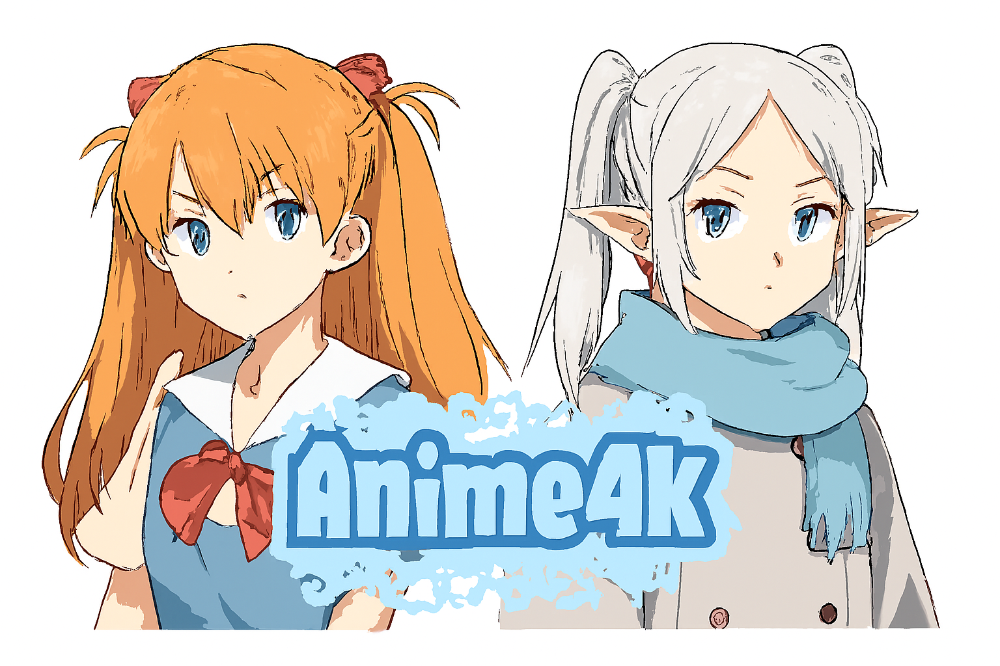
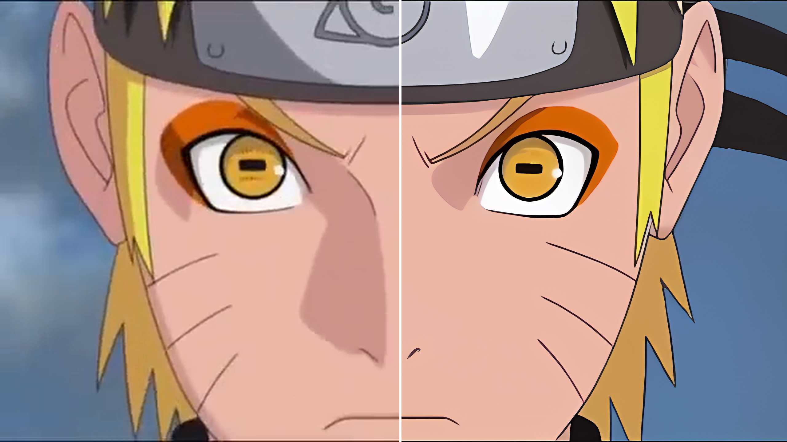
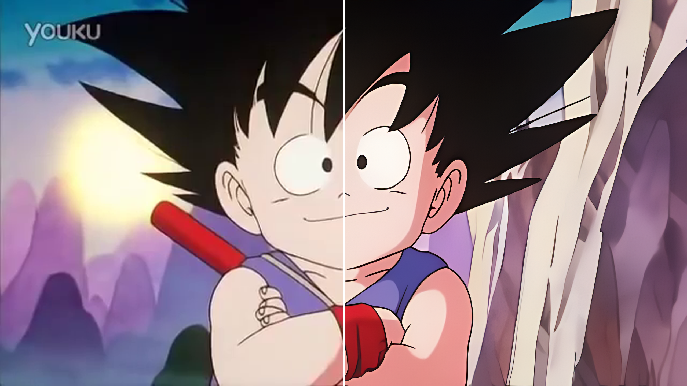
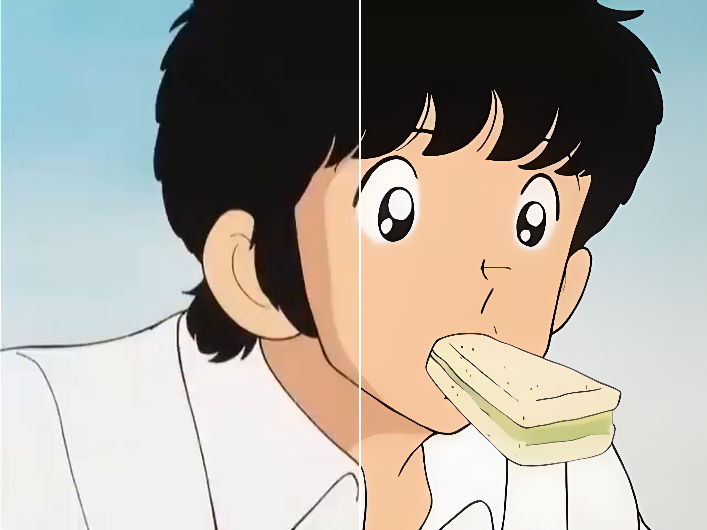

# Anime4K

Anime4K is a cutting-edge solution for anime image super-resolution (SR) that utilizes a hybrid CNN-Transformer architecture, combined with a custom-built 4K resolution dataset specifically designed for anime images. This project aims to provide a high-quality solution for enhancing anime content, preserving fine details, maintaining color fidelity, and improving overall image quality.

## Update 🔥🔥🔥
- [ ] Release Paper version implementation of Anime4K
- [ ] Publicly release the **A4K dataset**
- [ ] Release different upscaler factor weight (for 2x, 4x and more)
- [ ] Create a Project Page
- [ ] Some Online Demo for Chinese users && README in Chinese

## Key Features

- **A4K Dataset**: The first 4K resolution dataset tailored specifically for anime super-resolution, which combines perceptual quality and structural complexity.
- **AniFusionNet**: A hybrid CNN-Transformer network architecture that achieves superior performance in anime super-resolution by integrating both local texture modeling and long-range dependency learning.
- **Ground Truth (GT) Enhancement**: A targeted GT enhancement strategy that selectively strengthens hand-drawn line structures, ideal for anime images.

##  Visualization (Click them for the best view!) 👀

<!-- Asuka:https://cdn.knightlab.com/libs/juxtapose/latest/embed/index.html?uid=8e80d844-62b6-11f0-bb24-0936e1cb08fb -->
<!-- EVA: https://cdn.knightlab.com/libs/juxtapose/latest/embed/index.html?uid=a52ca656-62b9-11f0-bb24-0936e1cb08fb -->
<!-- naruto: https://imgsli.com/MjQ1NzIy -->
<!-- onepiece: https://imgsli.com/MjQ1NzM5 -->
<!-- dragonball: https://imgsli.com/MjQ1NzIz -->
<!-- gintama: https://imgsli.com/MjQ1NzMw -->
<!-- goplayer: https://imgsli.com/MjQ1NzMx -->
<!-- touch: https://imgsli.com/MjQ1NzMy -->

  

 

  

 

<!--------------------------------------------  --------------------------------------------------->

